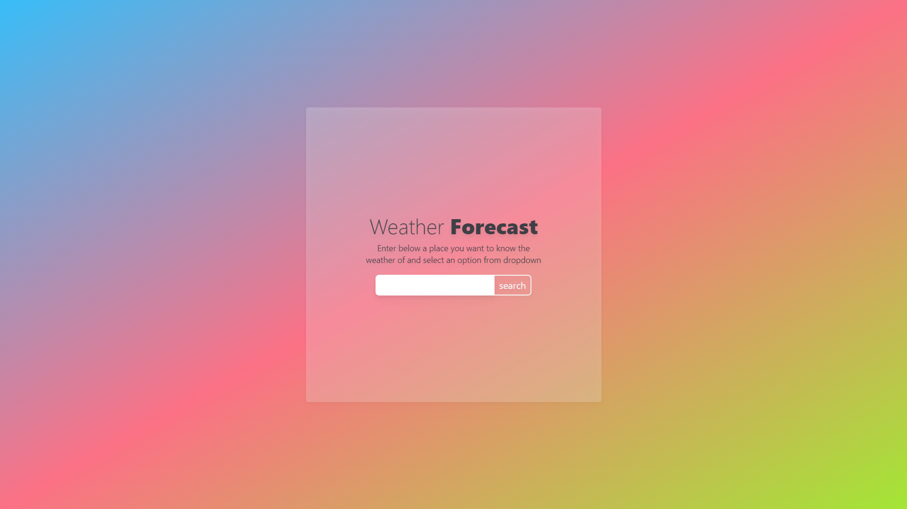

# Forecastify

Forecastify is your ultimate weather companion built with React and TypeScript. It provides precise forecasts, interactive maps, and real-time updates to keep you informed about the weather conditions that matter most to you.

## Features

- Accurate weather forecasts
- Interactive maps
- Real-time updates

## Technologies Used

- React
- TypeScript

## Topics

- React
- JavaScript
- Open-source development
- TypeScript
- UI design
- Weather API
- Weather forecasting
- Weather app
- Happy coding
- React 18

Feel free to explore the repository and contribute to make weather tracking a seamless experience!
## Contributing

Contributions are welcome! If you'd like to contribute:
1. Fork the repository
2. Create a new branch: `git checkout -b feature-name`
3. Make your changes and commit them: `git commit -m 'Add new feature'`
4. Push to the branch: `git push origin feature-name`
5. Create a pull request

## License

This project is licensed under the [MIT License](LICENSE).

---
make with ~~lust~~ love 💖 by @sameerkali
